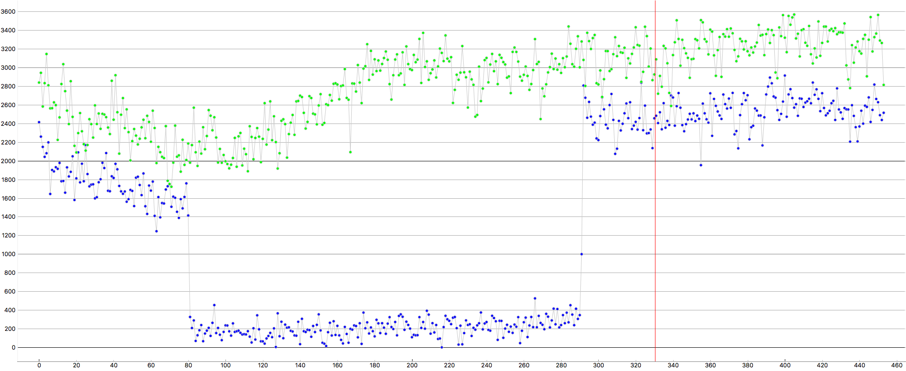
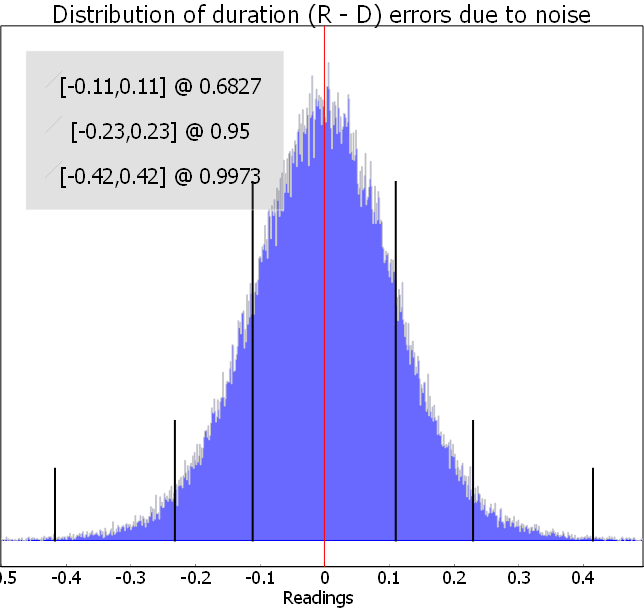

.. pyote documentation master file, created by
   sphinx-quickstart on Sun Jun 18 14:21:27 2017.
   You can adapt this file completely to your liking, but it should at least
   contain the root `toctree` directive.

Welcome to pyote's documentation!
=================================

.. toctree::
   :maxdepth: 2
   :caption: Contents:

Introduction
============

Here is a sample main plot from **pyote**:

   Just a sample to whet your appetite

Chapter 1
---------

There's not much to see yet, but I'll get working on this once
I get back from the Canada trip.

Second paragraph starts now ...

   Error bar analysis is a central capability of **pyote**

And the code to get all this wonderfulness started is ::

   from pyoteapp import pyote
   pyote.main()

And more will follow shortly.